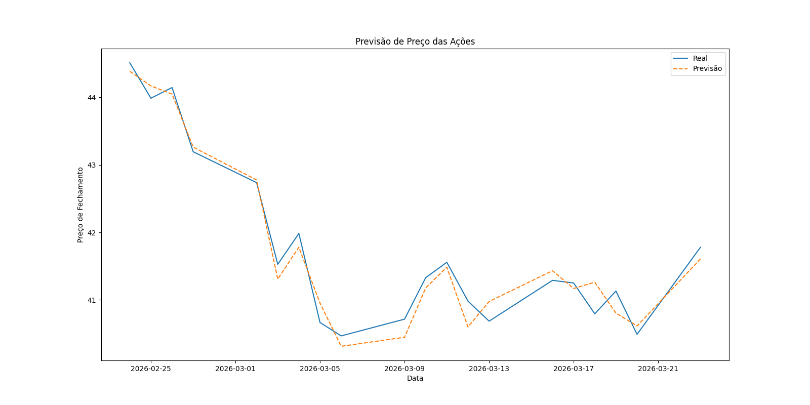

# 📈 Previsão de Preço de Ações com Machine Learning

Este projeto utiliza Machine Learning para prever o preço de fechamento de ações com base em dados históricos da bolsa.

## 🚀 Tecnologias utilizadas

- Python
- Pandas
- Scikit-learn
- Matplotlib
- Yahoo Finance API (yfinance)

---

## 📊 Objetivo

Criar um modelo capaz de prever o preço de fechamento de ações utilizando:

- Dados históricos
- Engenharia de features (médias móveis)
- Modelos de Machine Learning

---

## 🧠 Modelos utilizados

- Regressão Linear
- Rede Neural (MLPRegressor)

O modelo final é escolhido automaticamente com base no melhor desempenho (R²).

---

## ⚙️ Pipeline do projeto

1. Coleta de dados com Yahoo Finance
2. Limpeza e tratamento dos dados
3. Criação de features:
   - Média móvel de 5 dias
   - Média móvel de 14 dias
   - Média móvel de 21 dias
4. Separação entre treino e teste (sem embaralhamento)
5. Normalização dos dados
6. Treinamento dos modelos
7. Avaliação com R²
8. Geração de previsões
9. Visualização dos resultados

---

## ⚠️ Boas práticas aplicadas

Foi aplicada normalização **apenas nos dados de treino** para evitar **data leakage**, garantindo maior confiabilidade na avaliação do modelo.

---

## 📈 Resultados

### Quantidade de dados

- Treino: 981 registros  
- Teste: 246 registros  

### Performance dos modelos

- Regressão Linear: **99.89% R²**
- MLPRegressor: **82.52% R²**

---

## 📊 Previsões

| Data       | Real  | Previsão |
|------------|-------|----------|
| 2026-02-24 | 44.51 | 44.39    |
| 2026-02-25 | 43.99 | 44.17    |
| 2026-02-26 | 44.15 | 44.05    |
| 2026-02-27 | 43.20 | 43.26    |
| 2026-03-02 | 42.74 | 42.78    |
| 2026-03-03 | 41.53 | 41.31    |
| 2026-03-04 | 41.98 | 41.78    |
| 2026-03-05 | 40.67 | 40.95    |
| 2026-03-06 | 40.47 | 40.31    |
| 2026-03-09 | 40.71 | 40.45    |
| 2026-03-10 | 41.33 | 41.18    |
| 2026-03-11 | 41.56 | 41.48    |
| 2026-03-12 | 40.98 | 40.60    |
| 2026-03-13 | 40.68 | 40.98    |
| 2026-03-16 | 41.29 | 41.43    |
| 2026-03-17 | 41.25 | 41.17    |
| 2026-03-18 | 40.79 | 41.26    |
| 2026-03-19 | 41.13 | 40.80    |
| 2026-03-20 | 40.49 | 40.61    |
| 2026-03-23 | 41.78 | 41.61    |

## 📉 Gráfico



---

## ▶️ Como executar

### 💻 Executar localmente
```bash
pip install -r requirements.txt
python code_prediction.py
```

### ☁️ Ou executar no Google Colab (sem instalar nada)

[](https://colab.research.google.com/drive/1TvD0HFv06HEmkv2oMlJfPnLswj-crnok?usp=sharing)
